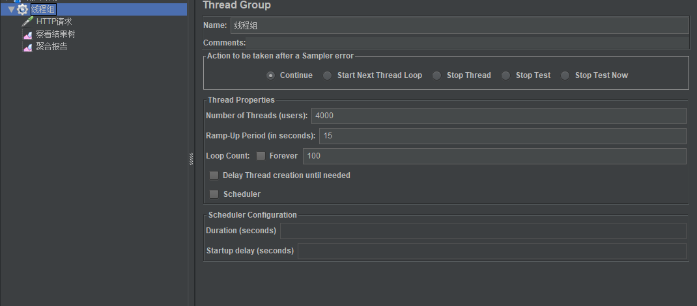
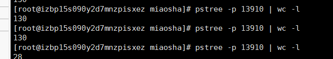

## 并发容量问题
>在aliyun上部署项目后（1cpu2G）<br>
>编写deploy脚本并运行
```
nohup java -Xms400m -Xmx400m -XX:NewSize=200m -XX:MaxNewSize=200m -jar miaosha.jar --spring.config.addition-location=/var/www/miaosha/application.properties
```
使用jmeter压测软件 设置如下

结果如下

服务器线程数


发现线程数维持在130，然而请求的线程数达到4000，error率很高


## 问题
>这是因为服务器内置的tomcat的服务器默认配置线程数上不去
### 查看Springboot配置
>spring-configuration-metadata.json文件
>查看各个节点的配置
```
//端口配置
    "name": "server.port",
      "type": "java.lang.Integer",
      "description": "Server HTTP port.",
      "sourceType": "org.springframework.boot.autoconfigure.web.ServerProperties",
      "defaultValue": 8080
//最大等待队列数 默认为100 
{
      "name": "server.tomcat.accept-count",
      "type": "java.lang.Integer",
      "description": "Maximum queue length for incoming connection requests when all possible request processing threads are in use.",
      "sourceType": "org.springframework.boot.autoconfigure.web.ServerProperties$Tomcat",
      "defaultValue": 100
},
//最小空闲线程数量
{
      "name": "server.tomcat.min-spare-threads",
      "type": "java.lang.Integer",
      "description": "Minimum amount of worker threads.",
      "sourceType": "org.springframework.boot.autoconfigure.web.ServerProperties$Tomcat",
      "defaultValue": 10
    },
//最大连接数 8192 默认配置下，连接超过8192就会被拒绝连接
{
      "name": "server.tomcat.max-connections",
      "type": "java.lang.Integer",
      "description": "Maximum number of connections that the server accepts and processes at any given time. Once the limit has been reached, the operating system may still accept connections based on the \"acceptCount\" property.",
      "sourceType": "org.springframework.boot.autoconfigure.web.ServerProperties$Tomcat",
      "defaultValue": 8192
    },
//最大支持的线程数 200
{
      "name": "server.tomcat.max-threads",
      "type": "java.lang.Integer",
      "description": "Maximum amount of worker threads.",
      "sourceType": "org.springframework.boot.autoconfigure.web.ServerProperties$Tomcat",
      "defaultValue": 200
    },
    
    
    可见，触发请求超过200+100后就会拒绝处理
```

### 调优
修改application.properties外挂文件
```
server.port=80
server.tomcat.accept-count=500
server.tomcat.max-threads=500
server.tomcat.min-spare-threads=100
```
>可以将线程数从原来的100+ 调整到500+