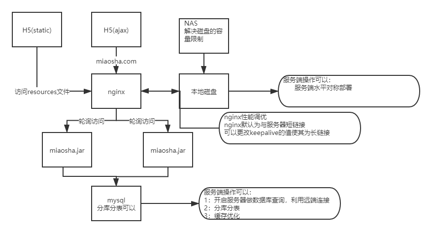
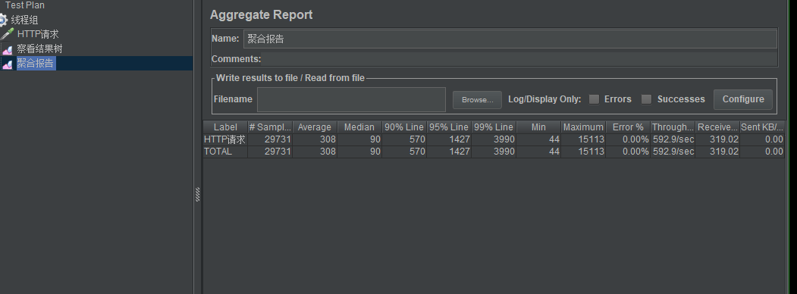

## 单机性能问题
>单机的性能瓶颈很大，在不能支持高并发请求情况,
>不管是带宽、cpu、还是内存都会有一定的影响。

### 处理
>使用服务器集群的方式部署如下

>利用nginx反向代理，将请求轮询给多个处理服务器（这里为两台）
后端服务器都在数据库所在服务器上访问mysql（需要开启服务器的访问权限）

#### 优化对比
>首先在一台单机上完成压测 1cpu2G 1M  并发请求量为500 循环30次

>优化后

#### nginx 再优化
>通过对web（nginx代理）服务器的运行时使用命令`netstat -an | grep 172.16.17.142 | wc -l
`发现nginx在代理时是建立的短连接，对性能优化不友好

>修改conf文件设置keepalive属性

#### 问题
>1 数据库服务器的带宽还是受限
