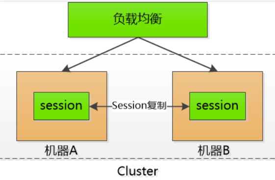
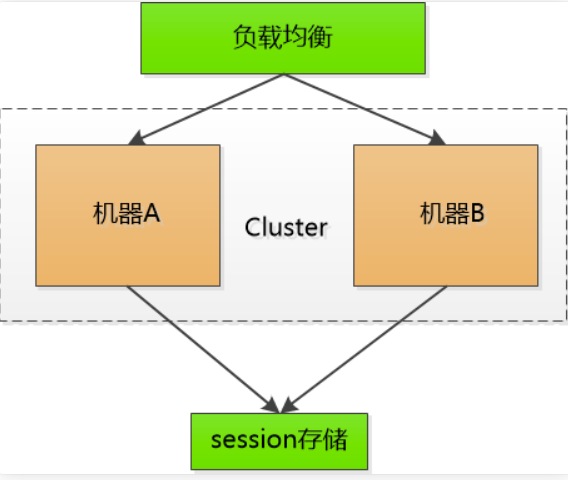
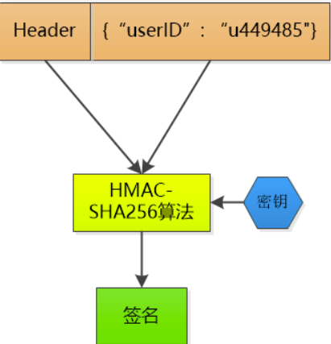
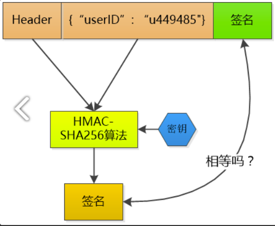

## 优化会话管理
>开始我使用的是基于cookieid ： java tomcat 容器session实现
>code
```
//验证手机号和对应的optcode相符合
        String inSessionOptCode = (String)httpServletRequest.getSession().getAttribute(telephone);
            // 用druid的比较防止都为null
        if(!StringUtils.equals(optCode, inSessionOptCode)){
            throw new BusinessException(EmBusinessError.PARAMETER_VALIDATION_ERROR,"短信验证码不符合");
        }
        
//存储登录信息
//加入到用户登录成功的session类
        //假设单点session登录
        this.httpServletRequest.getSession().setAttribute("IS_LOGIN", true);
        this.httpServletRequest.getSession().setAttribute("LOGIN_USER", userModel);
//获取用户的登录信息
        Boolean isLogin = (Boolean) httpServletRequest.getSession().getAttribute("IS_LOGIN");
        if(isLogin == null || !isLogin.booleanValue()){
            throw new BusinessException(EmBusinessError.USER_NOT_LOGIN, "用户登录信息异常");
        }
        UserModel loginUser = (UserModel) httpServletRequest.getSession().getAttribute("LOGIN_USER");
```

问题
>在许多移动端在用户层面会把cookie屏蔽掉 可以使用token
>在分布式部署时，基于基于cookieid的会话是在tomcat的内存上的，当多台server上会造成会话丢失，
>session没有维护在集中管理的地方，而是在各自的服务器上


### 分布式会话管理
>使用redis缓存集中管理对应session

#### cookie  session  token
>http是无状态的，要管理会话就必须让每一个客户端保存一个sessionid(随机且唯一的字符串），<br>
发起http请求就带上这个字符串,服务器保存所有的sessionid<br>
>问题！ 服务器集群相互间sessionid不能共享，导致性能大幅下降<br>
<br>

>sessionid 集中管理， 利用nosql来作为集中管理器，类似Memcached、redis<br>
>redis（支持的数据类型更多）<br>
<br>

>问题！ 为什么不能让客户端来保存sessionid呢，所以衍生了新办法，一个用户登录，服务端<br>
>给他一个令牌（token），里面包含着他的类似sessionid，如果这个客户端再请求的就直接将token<br>
>通过http header发送过来。为了防止别人伪造，对数据做一个签名<br>
<br>
<br>

>这样服务端就可以不用存储sessionid了，只是生成token验证token，计算而已

##### cookie & session
>由于http的无状态性，为了使某个域名下的所有网页能够共享某些数据，session和cookie出现了。客户端访问服务器的流程如下
1. 首先，客户端会发送一个http请求到服务器端。
2. 服务器端接受客户端请求后，建立一个session，并发送一个http响应到客户端，
这个响应头，其中就包含Set-Cookie头部。该头部包含了sessionId。
>Set-Cookie: value[; expires=date][; domain=domain][; path=path][; secure]
3. 在客户端发起的第二次请求，假如服务器给了set-Cookie，浏览器会自动在请求头中添加cookie
4. 服务器接收请求，分解cookie，验证信息，核对成功后返回response给客户端

>简而言之, session 有如用户信息档案表, 里面包含了用户的认证信息和登录状态等信息. 而 cookie 就是用户通行证

##### token
>token在客户端一般存放于localStorage，cookie，或sessionStorage中。在服务器一般存于数据库中

1. 用户登录，成功后服务器返回Token给客户端。
2. 客户端收到数据后保存在客户端
3. 客户端再次访问服务器，将token放入headers中
4. 服务器端采用filter过滤器校验。校验成功则返回请求数据，校验失败则返回错误码

##### 对比
1. token可以抵抗csrf，cookie+session不行
>因为form 发起的 POST 请求并不受到浏览器同源策略的限制，因此可以任意地使用其他域的 Cookie 向其他域
发送 POST 请求，形成 CSRF 攻击。在post请求的瞬间，cookie会被浏览器自动添加到请求头中。但token不同，
token是开发者为了防范csrf而特别设计的令牌，浏览器不会自动添加到headers里，攻击者也无法访问用户的token，
所以提交的表单无法通过服务器过滤，也就无法形成攻击
2. 分布式情况下的session和token
>客户端登陆传递信息给服务端，服务端收到后把用户信息加密（token）传给客户端，客户端将token存放于localStroage
等容器中。客户端每次访问都传递token，服务端解密token，就知道这个用户是谁了。通过cpu加解密，
服务端就不需要存储session占用存储空间，就很好的解决负载均衡多服务器的问题了
3. 总结
>session存储于服务器，可以理解为一个状态列表，拥有一个唯一识别符号sessionId。服务器收到cookie后解析出sessionId，再去session列表中查找，才能找到相应session。依赖cookie
cookie类似一个令牌，装有sessionId，存储在客户端，浏览器通常会自动添加。
token也类似一个令牌，无状态，用户信息都被加密到token中，服务器收到token后解密就可知道是哪个用户。需要开发者手动添加。
jwt只是一个跨域认证的方案
