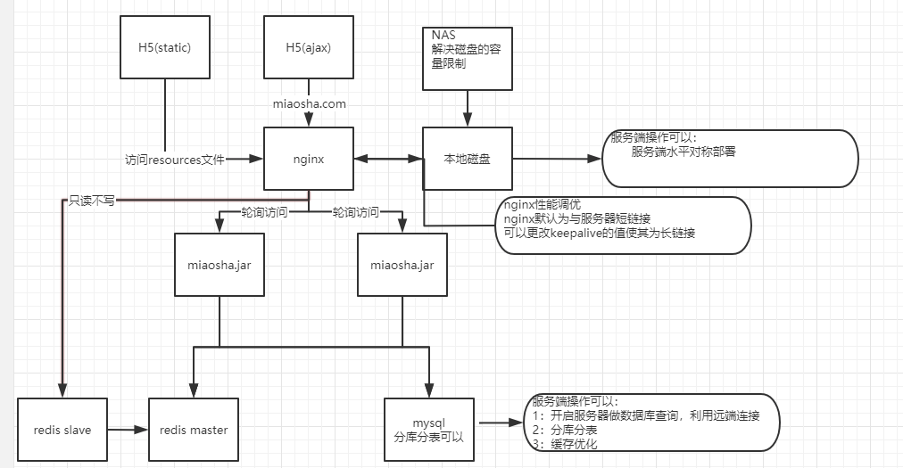

## 查询性能优化之多级缓存
设计原则:
1. 快速存取设备，用内存
2. 将缓存推到离用户最近的地方
3. 脏缓存处理

### redis缓存 -- nosql
   
```
public ReturnType getItem(@RequestParam(name="id")Integer id){
        //根据商品的id去redis获取
        ItemModel itemModel = (ItemModel) redisTemplate.opsForValue().get("item_" + id);

        //不存在就访问下游service
        if(itemModel == null){
            itemModel = itemService.getItemById(id);

            //存储
            redisTemplate.opsForValue().set("item_" + id, itemModel);
            redisTemplate.expire("item_" + id, 10, TimeUnit.MINUTES);
        }
        return ReturnType.create(convertViewFromModel(itemModel));
    }
```
>注意：注意序列化和反序列化存储数据。

### 本地热点数据缓存
设计：
1. 热点数据
2. 脏读不敏感
3. 内存可控
设计：一个hashmap 但线程不安全
        ConcurrentHashmap 段的加锁，影响性能

##### Guava cache 
1. 可控制的大小和超时时间
2. 可配置的lru策略
3. 线程安全

采用多级缓存：
```
ItemModel itemModel = null;
        //先去本地缓存
        itemModel = (ItemModel) cacheService.getFromCommonCache("item_" + id);

        if(itemModel == null) {
            //根据商品的id去redis获取
            itemModel = (ItemModel) redisTemplate.opsForValue().get("item_" + id);

            //不存在就访问下游service
            if (itemModel == null) {
                itemModel = itemService.getItemById(id);
                //存储到redis
                redisTemplate.opsForValue().set("item_" + id, itemModel);
                redisTemplate.expire("item_" + id, 10, TimeUnit.MINUTES);
            }
            cacheService.setCommonCache("item_" + id, itemModel);
        }
```

>性能
 有20%的性能提升

#### nginx cache 缓存
>利用nginx本地内存缓存数据，离用户更近

```
#申明一个cache缓存节点的内容
    proxy_cache_path /usr/local/openresty/nginx/tmp_cache levels=1:2 keys_zone=tmp_cache:100m inactive=7d max_size=10g;
    ##添加
    proxy_cache tmp_cache;
    proxy_cache_key $uri;
    proxy_cache_valid 200 206 304 302 7d;
    到location / {}
        .....
```

>压测  与前面分布式变化不大，甚至性能有下降，因为此时是访问nginx所在的本地磁盘。不在内存中,弃用

#### nginx 协程
>1. nginx 的每一个worker进程都是在epoll或kqueue这种事件模型之上，封装成协程
>2. worker进程会new一个协程完成http request 的完整周期，如果没有遇到block，就会通过反向代理获取后端的response并返回
>3. worker进程 等待后端返回response时遇到block，主动返回执行权限，将socket连接交给epoll模型,等待后端的response响应唤醒
worker进程 又会new一个协程出来完成对应操作
>4. nginx 每一个工作进程创建一个lua虚拟机
>5. 一个进程所以的协程共享一个vm
>6. 每一个外部请求有一个lua协程处理，之后数据隔离
>7. lua代码调用io等异步接口时，协程被挂起(往epoll模型注册)，上下文数据保持不变
>8. 自动保存，不阻塞工作进程 
>9. io异步操作完成后还原协程上下文，代码继续执行


##### OpenResty 默认集成lua开发环境，是的Nginx可以作为Web Server使用
>1. 借助于Nginx的事件驱动模型和非阻塞IO，可以实现高性能的web应用程序 
>2. OpenResty提供大量的组件如Mysql、Redis、Memcached等等 <br>
<br>
> shared dic : 共享内存字典，所以worker进程可见，lru淘汰
lua代码使用nginx的内存

```
function get_from_cache(key)
        local cache_ngx = ngx.shared.my_cache
        local value = cache_ngx:get(key)
        return value
end

function set_to_cache(key, value, exptime)
        if not exptime then
                exptime = 0;
        end
        local cache_ngx = ngx.shared.my_cache
        local succ,err,forcible = cache_ngx:set(key,value,exptime)
        return succ
end

local args = ngx.req.get_uri_args()
local id = args["id"]
local item_model = get_from_cache("item_"..id)
if item_model == nil then
        local resp = ngx.location.capture("/item/getitem?id="..id)
        item_model = resp.body
        set_to_cache("item_"..id, item_model,1*60)
end
ngx.say(item_model)

```
nginx.conf

```
#申明一个cache缓存节点的内容（本地磁盘，弃用）
    #proxy_cache_path /usr/local/openresty/nginx/tmp_cache levels=1:2 keys_zone=tmp_cache:100m inactive=7d max_size=10g;
#本地内存
lua_shared_dict my_cache 128m;
location /luaitem/get {
                default_type "application/json";
                content_by_lua_file ../lua/itemsharedic.lua;
<<<<<<< HEAD:服务器调优/_04查询性能优化.md
}    
=======
}  
>>>>>>> origin/master:服务器调优/_04查询性能优化之多级缓存.md

```

>性能：和多级缓存性能差别不大，将主要压力都集中到了nginx服务器上

##### 采用OpenResty和远程redis优化接入层
如图，由于热点数据已经存入到了redis（以json格式）为何不直接从远程redis服务器上直接
读取？


注意！
>nginx只读不写，由于资源有限，我没有实现redis的主从实现
<<<<<<< HEAD:服务器调优/_04查询性能优化.md
>从lua代码实现只写。

=======
>从lua代码实现只读不写。
>>>>>>> origin/master:服务器调优/_04查询性能优化之多级缓存.md

```
local args = ngx.req.get_uri_args()
local id = args["id"]
local redis = require "resty.redis"
local cache = redis:new()
local ok,err = cache:connect("172.16.17.141",6379)
local item_model = cache:get("item_"..id)
if item_model == ngx.null or item_model == nil then
        local resp = ngx.location.capture("/item/getitem?id="..id)
        item_model = resp.body //注意，此时不写入redis！只读取
end

ngx.say(item_model)

nginx.conf配置


default_type "application/json";
content_by_lua_file ../lua/itemredis.lua;

```

！结果 性能大大优化


从最初的单机每秒Throughput为200左右到了接近1300！
