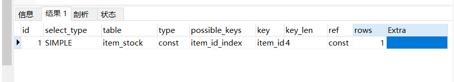

### 交易性能优化
确认交易链路的性能瓶颈问题：
1. 数据库 （io、锁）
2. 文件系统
3. 网络  （带宽限制）
4. 内存

#### 读热点问题
1. 多级缓存解决读热点--详见[查询性能优化](./_04查询性能优化.md)
2. 但是商家如果做了价格或者库存的修改，立马需要对写热点而造成的缓存脏数据进行清理，升级为读写混合的热点问题

##### 读热点解决方案
1. 基于数据库的操作，频繁的是select where 条件， 利用explain 看是否走了索引
>依据：在innodb buffer缓冲区足够大的情况下，mysql可以抗上亿的数据。解决点的问题<br>
>处理：<br>
>在进行数据的select查询库存时<br>
```
//唯一索引
alter  table  `table_name` add unique  (`字段名`)
//普通索引
alter table `table_name`  add  index `index_name` (`字段名`)
//联合索引
create index index_name on tablename(xx,xx,xx)

explain select stock
from item_stock 
where item_id = 7 and stock > 0;
```
<br>
>可见在给item_id添加索引后，查询type从all到const，优化十分明显--（详查索引底层原理）

>问题：此时的瓶颈是来源热，频繁的访问会使得mysql的cpu扛不住？
2. 缓解sql的cpu压力，放到缓存中去卸载压力，可以利用redis4以后的版本可以使用cluster的集群模式
>依据：借助分片集群的效果理论上可以扩展到1000左右的节点<br>

```
//活动发布时，由运营后台或者定时器通过itemController接口的/publishPromo直接将热点数据缓存到redis中
        Promo promo = promoMapper.selectByPrimaryKey(promoId);
        if(promo.getItemId() == null || promo.getItemId().intValue() == 0){
            //没有对应的商品
            return;
        }
        ItemModel itemModel = itemService.getItemById(promo.getItemId());
        //库存同步到redis中
        redisTemplate.opsForValue().set("promo_item_stock_" + itemModel.getId(), itemModel.getStock());
        redisTemplate.expire("promo_item_stock_" + itemModel.getId(), 2, TimeUnit.HOURS);
//然后就在缓存中访问，但是要注意缓存穿透和缓存击穿和缓存雪崩问题，在后续会仔细介绍。
```
>多级缓存：<br>
>使用google研发的guava cache包，提供了很好lru的cache队列的能力
```
//封装的本地内存 缓存方法
@Service
public class CacheServiceImpl implements ICacheService {

    private Cache<String, Object> commonCache = null;

    @PostConstruct
    public void init(){
        commonCache = CacheBuilder.newBuilder()
                //设置缓存的初始容量
                .initialCapacity(10)
                //设置缓存的最大可以存储的100个key，超过100个就会按照LRU的策略移除缓存项
                .maximumSize(100)
                //设置过期时间
                .expireAfterWrite(60, TimeUnit.SECONDS).build();
    }

    @Override
    public void setCommonCache(String key, Object value) {
        commonCache.put(key, value);
    }

    @Override
    public Object getFromCommonCache(String key) {
        return commonCache.getIfPresent(key);
    }
}
```
>问题：商家变更了读热点的数据，如何清理脏数据？<br>
>处理：采取异步清除缓存的方法将redis的数据清除，这样在下一次的请求中可以依靠数据的回源更新redis数据。<br>
>实现：利用广播下mq消息解决，例如rocketmq的广播型消息，使得订阅商品信息变更的所有应用服务器都有机会清理缓存内存。

#### 写热点问题
1. 读问题可以实现并发，可以做到无锁操作<br>
2. 写操作没有真正意义的并发，都需要加锁以防并发的方式写入数据库中或文件存储中

##### 写热点问题的解决
1. 基于数据库的优化
>依据：基于写事务日志的存在，也就是redo，undo log，然后等系统空闲的时候刷入磁盘。<br>
>问题：终究是磁盘上的操作
2. redis缓存件
>问题1：超卖（缓存丢失） rockentmq异步事务型消息保持redis和数据库的数据同步（延迟加载）<br>
>问题2：后端服务器的压力还是很大<br>
>问题根本：写一份数据是不能并发，必须要通过竞争锁的机制去获得线程的写入权限，消耗性能<br>
>处理：排队--先到先得，对写入访问的操作队列化 或者使用单线程的方法 -- 缓冲入账
```
        @PostConstruct
            public void init(){
                //开启20个线程大小的线程池
                executorService = Executors.newFixedThreadPool(20);
                orderCreateRateLimiter = RateLimiter.create(300);
            }
        //下单接口同步调用线程池的submit方法
        //拥塞窗口为20的等待队列，用来队列泄洪
        Future<Object> future = executorService.submit(new Callable<Object>() {
            @Override
            public Object call() throws Exception {
                //加入库存流水init状态  用于追踪库存扣减异步消息
                String stockLogId = itemService.initStockLog(itemId, amount);
                //完成对应的下单事务型消息
                boolean createOrderResult = mqProducer.transactionAsynReduceStock(itemId, userModel.getId(), promoId, amount, stockLogId);
                if (!createOrderResult) {
                    throw new BusinessException(EmBusinessError.MQ_SEND_FAIL);
                }
                return null;
            }
        });

        try {
            future.get();
        } catch (InterruptedException | ExecutionException e) {
            throw new BusinessException(EmBusinessError.UNKNOWN_ERROR);
        }
        
        @PostConstruct
            public void init(){
                //开启20个线程大小的线程池
                executorService = Executors.newFixedThreadPool(20);
                orderCreateRateLimiter = RateLimiter.create(300);
            }
```

#### 交易验证优化


