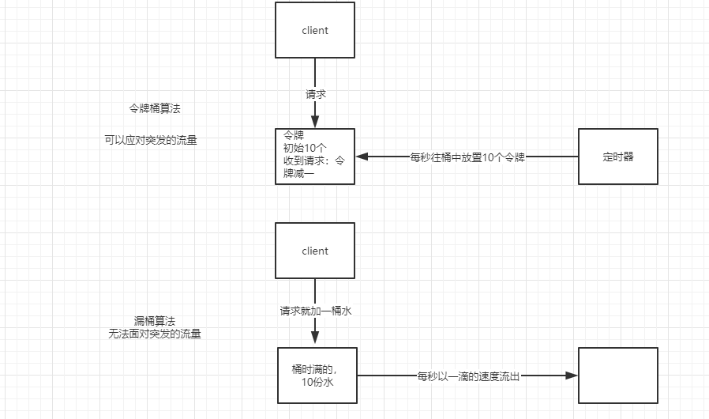

### 防刷限流优化

##### 验证码
1. 包装秒杀令牌前置，需要验证码来错峰
2. 秒杀答题验证

#### 限流
1. 限制并发 
方法
> 令牌桶  
> 漏桶算法 -无法应对突发流量

2. 限流办法
>集群限流：依赖redis或者其他中间件做统一计数器，会产生性能瓶颈 
>单机限流：负载均衡的前提下单机性能平均限流效果更好

#### 防刷
排队，限流，令牌都只能控制总流量，无法控制黄牛流量
1. 传统防刷
>限制一个会话（sessionid，token）同一秒钟/分钟接口调用的次数：-----多会话接入绕开无效 
>限制ip 接口调用多少次数：--数量不好限制，容易误伤,黑客可以伪造地址 

2. 为什么难防
>模拟器作弊，隐藏各种信息 
>设备牧场作弊，各种设备 
>人工作弊 

3. 设备指纹！
>采集终端设备的各项参数，启动应用时生成唯一设备指纹 
>根据对应设备指纹的参数猜测出模拟器等可疑设备概率 
>多维度获取（比如是否具有蓝牙功能） 

4. 凭证系统
>根据设备指纹下发凭证 
>关键业务链路上带上凭证并由业务系统到凭证服务器上验证 
>凭证服务器根据对应凭证所等价的设备指纹参数并根据实时的行为风控系统判定对应的品证的可疑度分数
>若分数低于某个值则返回固定错误码，拉起前端验证码验身，验身成功后加入凭证服务器对应分数（可疑度降低）
